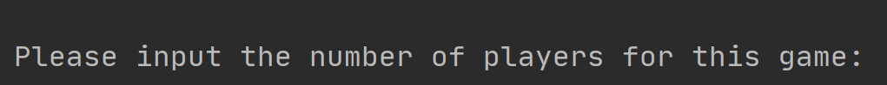
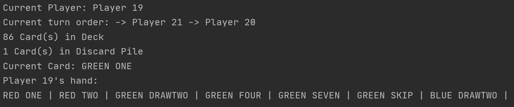
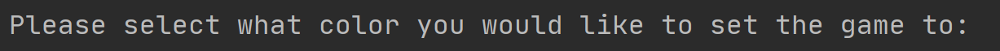
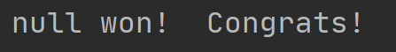

## Manual Test Plan

### Prerequisites

Needs up to date JDK and JUNIT installed.

### Environment Setup

Eclipse or IntelliJ is recommended for easy running of test units.
No other environment setup required.

### Operations

When running, you should see the following displays for each given scenario.

This should be seen at the beginning when starting the test.

This is what the game status display should look like every turn.

This prompt should be displayed after playing a wild card.

This prompt should be displayed at the end of the game when a winner is decided.
Of course, null will be replaced with the name of the winner.
